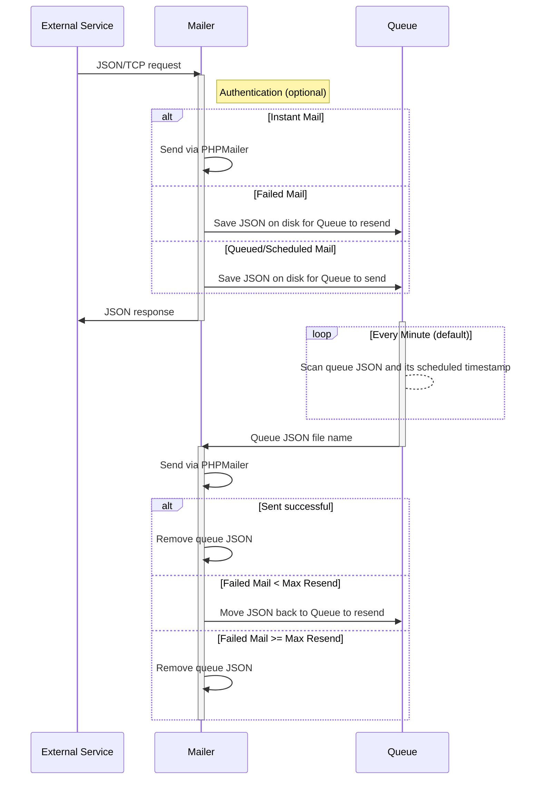

<p align="center"></p>

<h3 align="center">SMTP Mailer</h3>

<p align="center">
    A SMTP mail sending and scheduling service
    <br />
    <a href="./docs/api/README.md"><strong>API docs »</strong></a>
    /
    <a href="./docs/env/README.md"><strong>env docs »</strong></a>
    <br />
    <br />
    <a href="https://github.com/ecmchow/smtp-mailer/releases">View Releases</a>
    ·
    <a href="https://github.com/ecmchow/smtp-mailer/issues">Report Bug</a>
    ·
    <a href="https://github.com/ecmchow/smtp-mailer/issues">Request Feature</a>
    ·
    <a href="https://hub.docker.com/r/ecmchow/smtp-mailer">Docker Hub</a>
</p>

<p align="center">
  <a href="https://github.com/ecmchow/smtp-mailer/actions/"></a>
  <a href="https://github.com/ecmchow/smtp-mailer/releases"></a>
  <a href="https://www.php.net/releases/index.php"></a>
  <a href="https://opensource.org/licenses/MIT"></a>
  <a href="https://github.com/ecmchow/smtp-mailer/CODE_OF_CONDUCT.md"></a>
</p>

<br/>

<!-- TABLE OF CONTENTS -->
<details>
  <summary>Table of Contents</summary>
  <ol>
    <li><a href="#introduction">Introduction</a></li>
    <li><a href="#features">Features</a></li>
    <li><a href="#dependencies">Dependencies</a></li>
    <li><a href="#quickstart-with-docker">Quickstart with Docker</a></li>
    <li><a href="#overview">Overview</a></li>
    <li>
      <a href="#getting-started">Getting Started</a>
      <ul>
        <li><a href="#prerequisites">Prerequisites</a></li>
        <li><a href="#installation">Installation</a></li>
        <li><a href="#redis-integration">Redis Integration</a></li>
      </ul>
    </li>
    <li>
      <a href="#usage">Usage</a>
      <ul>
        <li><a href="#managing-service">Managing service</a></li>
        <li><a href="#service-api">Service API</a></li>
        <li><a href="#connecting-to-service">Connecting to service</a></li>
        <li><a href="#systemd-service">Systemd Service</a></li>
        <li><a href="#log-rotation">Log Rotation</a></li>
      </ul>
    </li>
    <li><a href="#changelog">Changelog</a></li>
    <li><a href="#contribution">Contribution</a></li>
    <li><a href="#author">Author</a></li>
    <li><a href="#license">License</a></li>
  </ol>
</details>

<br/>

## Introduction

SMTP Mailer is a **SMTP mail sending and scheduling service** powered by [Workerman](https://github.com/walkor/workerman) and [PHPMailer](https://github.com/PHPMailer/PHPMailer).

It is designed to be a one-stop and portable microservice for managing SMTP mailing operations across multiple applications/services. While it runs on PHP CLI, it can be integrated with any backend stack that supports internal JSON/TCP communication. It also includes a basic API for managing a file-based email queue and template without database dependency.

Running multiple apps with shared SMTP accounts and/or email templates? Want to send an HTML email from a Bash script? Just setup a default SMTP credentials and you can start sending email with a simple JSON/TCP request.

<br/>

## Features

* Instant/Queued/Scheduled SMTP sending API
* File-based queue and management API
* File-based email template and management API
* Auto resend upon failed mail delivery
* API password authentication (Optional)
* Queue data full-encryption (Optional)
* Redis integration (Optional)

<br/>

## Dependencies

* PHP-CLI >= 7.4 (with OpenSSL)
* [Composer](https://getcomposer.org/) >= 2.0
* [Workerman](https://github.com/walkor/workerman) >= 4.0
* [PHPMailer](https://github.com/PHPMailer/PHPMailer) >= 6.5

<br/>

## Quickstart with [Docker](https://hub.docker.com/r/ecmchow/smtp-mailer)

Copy the example Docker compose file:
* [docker-compose.yml](docker-compose.yml)

Before starting the service, make sure you have a setup directories for the queued mail/mail HTML template (ignore if you using Redis data store) and setup a valid SMTP credentials in the service env file. To avoid confusing the default env file for docker compose and the SMTP Mailer service, copy/rename the [.env.example](.env.example) to `.env.service` and change the listening address to `0.0.0.0`:
```ini
MAILER_ADDR = "0.0.0.0"
...
REDIS_ADDR = "0.0.0.0" ; if you are using Redis
```

Pass the service env file and directories through the Docker volumes
```txt
  smtp_mailer:
  ...
    volumes:
      - /path/to/your/.env.service:/var/www/smtp-mailer/.env # service env file
      - /path/to/html:/var/www/smtp-mailer/Template/html # HTML Template directory
      - /path/to/queue-mail:/var/www/smtp-mailer/Queue/mail # Queued mail directory
      - /path/to/processing-mail:/var/www/smtp-mailer/Queue/temp # Processing mail directory
```

Run `docker compose up -d` to start the SMTP Mailer service. The service will be available at `tcp://localhost:3000/` by default.

To test the SMTP Mailer service, simple run `echo '{"sendMail":{"to":["example@gmail.com"],"ccList":[],"bccList":[],"attachments":[],"embedded":[],"subject":"Test Email","body":"Test Email Body","fromName":"Test System"}}' | nc localhost 3000`, you should see the following response:
```json
{"status":"success","data":null,"message":"mail sent successfully"}
```

For detailed service env configuration, please visit the [env documentation](docs/env/README.md). You can view all available request and required schema in the [API documentation](docs/api/README.md).
<br/>

## Overview

The following sequence diagram illustrates the core process of the service.



<br/>

## Getting Started

### Prerequisites

For non-Docker installation, PHP >= 7.4 and OpenSSL support is required, with optional Sodium extension. Linux environment is recommended for production deployment. You may run the service locally on your MacOS/Windows machine for development, Windows with WSL is required to run the Mailer service and development tests. Please also note that this is a PHP CLI application, which does not require a web server or process manager such as PHP-FPM to function.

### Installation

There are several ways to install SMTP Mailer
* [Docker](https://hub.docker.com/r/ecmchow/smtp-mailer) (see above [Quickstart](#quickstart-with-docker))
* [PHAR package](https://github.com/ecmchow/smtp-mailer/releases) (recommended for non-Docker system)
* [ZIP release](https://github.com/ecmchow/smtp-mailer/releases) (without vendor and development files)
* Clone the project

If you are using the PHAR package, you might need to ensure the package binary is executable:
```console
chmod +x /path/to/smtp-mailer.phar
```

If you are using the ZIP release or cloning the project, you will need to install vendor packages with [Composer](https://getcomposer.org/):
```console
composer install
```

After downloading, create your own *.env* file by copying the example file:
* [.env.example](./.env.example) -> .env

Recommended file structure as follow:

    .
    ├── ...
    ├── smtp-mailer             # Service root folder
    │   ├── Queue               # (ignore if using Redis)
    │   │   ├── mail              # Queued/scheduled mail directory
    │   │   └── temp              # Queue processing directory
    │   ├── Template            # (ignore if using Redis)
    │   │   ├── html              # Production HTML template
    │   │   └── ...               # other folder for storing template dev files
    │   ├── ...                  
    │   ├── .env                # env configuration
    │   └── smtp-mailer.phar    # service executable / entry PHP script
    └── ...

Replace with your SMTP credentials and desired queue/template directory (ignore if you are using Redis data store). If you have enable the queue service, you will need to provide an base64-encoded private key since the service will encrypt the SMTP password or the full JSON document (if enabled in env) when saving to disk/Redis by default.

Make sure queue/template directory is readable/writeable by PHP with appropriate permission. For security reasons, you should ensure the env is only readable by the service. (e.g. service started by root on a linux server)
```console
chown root:root /path/to/.env
chmod 600 /path/to/.env
```

While SMTP Mailer is intended to be an internal service inside a trusted network, you should ensure the SMTP Mailer files is placed under a publicly inaccessible directory on your server. For additional security, you may provide a password hash and SSL cert/key to enable password authentication and SSL on TCP connection respectively.

For detailed environment configuration, please view the [env documentation](./docs/env/README.md)

After setting up the environment variables, you may start the service on your server terminal.

If you are using PHAR package, navigate to the folder containing the PHAR package
```console
php smtp-mailer.phar start -d
```

If you install with ZIP release or by cloning the project, navigate to the project folder:
```console
php start-mailer.php start -d
```

### Redis Integration

SMTP Mailer supports [Redis](https://redis.io/) out-of-the-box (Tested with Redis >= 5.0). Instead of using a file-based queue and/or template on local disk, you may instruct SMTP Mailer to use Redis as its data store. Make sure you have Redis extension enabled in your PHP config, and you may provide Redis connection details in the env.

SMTP Mailer will store the following JSON-serialized data with a key prefix defined in env (REDIS_KEY_PREFIX):
* Service status (Mail sent/failed count) 
* Queued/scheduled mail (optional with REDIS_STORE_QUEUE env)
* Mail template (optional with REDIS_STORE_TEMPLATE env)

Storing queue and/or template are completely optional, you may choose to use Redis to store your queued mail but still using a filed-based template on local disk.

<br/>

## Usage

### Managing service

Add *sudo* to the following command if the service started/managed by root. To automate and better manage your service on a linux server, please view the [Systemd Service](#systemd-service) section.

Replace `smtp-mailer.phar` with `start-mailer.php` if you are not using PHAR package or running shell inside Docker container.

Start, stop or restart service (-d to daemonize service, i.e. keep running service after you quit terminal)
```console
php smtp-mailer.phar start -d
php smtp-mailer.phar restart -d
php smtp-mailer.phar stop
```

Start, restart service with custom env path
```console
php smtp-mailer.phar start -d --env /path/to/env
php smtp-mailer.phar restart -d --env /path/to/env
```

Reloading service (*see notes*)
```console
php smtp-mailer.phar reload
```

Monitoring service
```console
php smtp-mailer.phar status
php smtp-mailer.phar connections
```

**Notes:** Use `reload` instead of `restart` for a smooth service reload. However only files loaded dynamically after `onWorkerStart` event will be reloaded. If you change anything that is declared before `onWorkerStart` such as service address/port or SSL connection settings, you must restart the service to apply changes.

### Service API

The service accepts TCP request with JSON encoded payload. All payload will pass through basic validation while mail sending request will be validated against a [JSON schema](./Core/schema/sendMail.json). You can view all available request and required schema in the [API documentation](./docs/api/README.md).

This is a basic request for sending SMTP mail
```json
{
    "sendMail": {
        "to": ["user@domain.com"],
        "ccList": [],
        "bccList": [
            ["name@domain.com", "Person Name"]
        ],
        "attachments": [
            ["/path/to/file", "doc.pdf"]
        ],
        "embedded": [
            ["/path/to/img", "logo", "logo.png"]
        ],
        "subject": "This is subject",
        "body": "<html>This is content</html>"
    }
}
```
Service response
```json
{
   "status": "success",
   "data": null,
   "message": "mail sent successfully"
}
```

### Connecting to service

You can use any client that can manage TCP connection. The following examples assumed your service is running on 127.0.0.1:3000

- [PHP Client](./docs/client/send.php)
- [NodeJS Client](./docs/client/send.js)
- [Shell script](./docs/client/send.sh)

## Systemd Service

**(Linux system only)**: You can create a service script to let systemd manage and start SMTP Mailer automatically on boot.

E.g. /etc/systemd/system/smtp-mailer.service
```ini
[Unit]
Description=SMTPMailer Service
After=network.target
StartLimitBurst=5
StartLimitIntervalSec=20

[Service]
Type=forking
ExecStart=/usr/bin/php /path/to/start-mailer.php start -d
ExecReload=/usr/bin/php /path/to/start-mailer.php reload
ExecStop=/usr/bin/php /path/to/start-mailer.php stop
Restart=always
RestartSec=5
PrivateTmp=true
RemainAfterExit=yes

[Install]
WantedBy=multi-user.target
```

You should reduce and adjust the RestartSec, StartLimitBurst, StartLimitIntervalSec value accordingly if the mail sending service is mission critical.

Reload the service files and starting the service.
```console
sudo systemctl daemon-reload
sudo systemctl start smtp-mailer
sudo systemctl status smtp-mailer
```

To enable or disable the service on system reboot
```console
sudo systemctl enable smtp-mailer
sudo systemctl disable smtp-mailer
```

To restart or reload the service
```console
sudo systemctl restart smtp-mailer
sudo systemctl reload smtp-mailer
```

### Log Rotation

**(Linux system only)**: Since Workerman generated log does not rotate automatically, it is a good idea to use [logrotate](https://linux.die.net/man/8/logrotate) to prevent it from eating up your server storage.

E.g. /etc/logrotate.d/smtp-mailer
```text
/path/to/smtp-mailer/smtp-mailer-workerman.log {
  rotate 14
  daily
  compress
  missingok
  notifempty
  create 0644 root root
}
```

<br/>

## Changelog

Detailed changes for each release are documented in the [release notes](https://github.com/ecmchow/smtp-mailer/releases).

<br/>

## Contribution

Please make sure to read the [Contributing Guide](./CONTRIBUTING.md) before making a pull request.

<br/>

## Author

[Eric Chow](https://cmchow.com)

<br/>

## License

This project is licensed under the [MIT](./LICENSE) License

Copyright (c) 2022, Eric Chow
